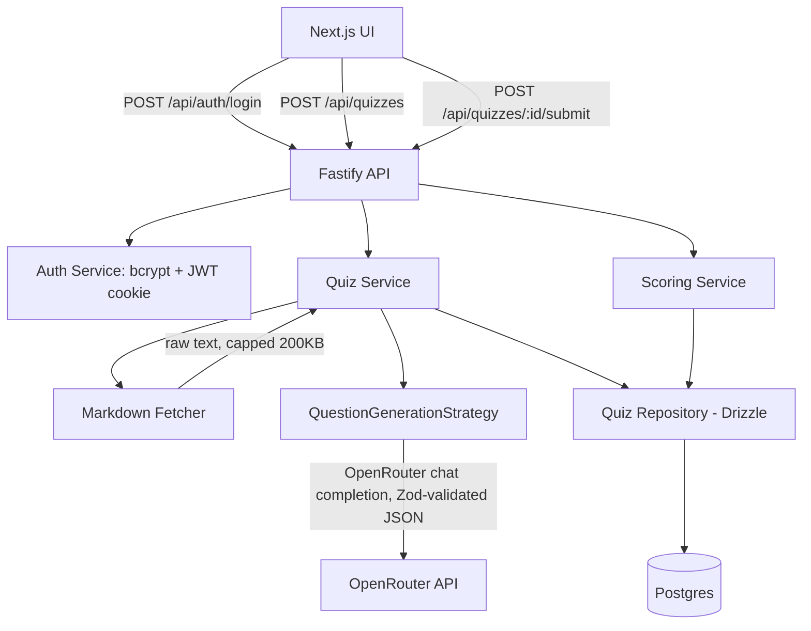

# Quiz Agent Design

**Spec**: `.specs/features/quiz-agent/spec.md`
**Status**: Draft

---

## Architecture Overview

PNPM monorepo: `apps/api` (Fastify REST + agent logic), `apps/web` (Next.js UI), `packages/shared` (Zod schemas + TS types shared both sides), `packages/db` (Drizzle ORM schema + migrations, Postgres).

Agent flow is a plain service pipeline, not a chat-loop agent framework — matches OpenRouter+Zod decision (no LangChain):



Request flow for generation: fetch → validate size/type → rewrite GitHub blob URL → call strategy → Zod-parse LLM output → retry once on failure → persist quiz+questions+options in one transaction → respond without correct-answer flags.

Request flow for submit: load quiz+questions+options → score per question → compute weighted final → persist submission+per-question scores in one transaction → respond with correctness + final score.

---

## Code Reuse Analysis

Greenfield project — nothing existing to reuse. Table intentionally minimal.

### Integration Points

| System | Integration Method |
|---|---|
| OpenRouter API | `openrouter` TS SDK client in `apps/api/src/services/llm/openrouter-client.ts`, called only from the generation strategy |
| Postgres | Drizzle ORM, `packages/db`, connection via `DATABASE_URL` env var, migrations via `drizzle-kit` |
| Docker | `docker-compose.yml` at repo root: `postgres` service + `api` + `web` services |

---

## Components

### `apps/api/src/services/auth/auth.service.ts`

- **Purpose**: Verify credentials, issue/verify JWT.
- **Interfaces**:
  - `login(email: string, password: string): Promise<{ token: string }>` — throws `InvalidCredentialsError` on mismatch
  - `verifyToken(token: string): { userId: string } | null`
- **Dependencies**: `bcrypt`, `jsonwebtoken`, `UserRepository`
- **Reuses**: n/a (greenfield)

### `apps/api/src/repositories/user.repository.ts`

- **Purpose**: Data access for `users` table only.
- **Interfaces**:
  - `findByEmail(email: string): Promise<User | null>`
- **Dependencies**: Drizzle client from `packages/db`

### `apps/api/src/services/markdown/markdown-fetcher.ts`

- **Purpose**: Fetch + validate a Markdown URL (size cap, content-type, GitHub blob→raw rewrite).
- **Interfaces**:
  - `fetchMarkdown(url: string): Promise<{ content: string; sourceUrl: string }>` — throws `SourceFetchError` (kind: `too_large` | `unreachable` | `not_text`)
- **Dependencies**: `fetch` (Node 20 global), no external HTTP lib needed

### `apps/api/src/services/quiz/generation-strategy.ts` (interface) + `default-generation.strategy.ts` (impl)

- **Purpose**: Turn Markdown text into 5-8 validated questions via OpenRouter, matching the shared Zod schema. Interface exists so a second strategy is addable later (P3) without touching callers.
- **Interfaces**:
  - `interface QuestionGenerationStrategy { generate(markdown: string): Promise<GeneratedQuiz> }`
  - `DefaultGenerationStrategy.generate(markdown: string): Promise<GeneratedQuiz>` — calls OpenRouter with a structured-output prompt, `GeneratedQuizSchema.parse()`s the response, retries once on `ZodError`, throws `GenerationFailedError` after retry exhausted
- **Dependencies**: OpenRouter client, `packages/shared` Zod schema

### `apps/api/src/services/quiz/quiz.service.ts`

- **Purpose**: Orchestrate fetch → generate → persist for `POST /api/quizzes`; load quiz for GET/submit.
- **Interfaces**:
  - `createQuiz(sourceUrl: string): Promise<QuizWithQuestions>`
  - `getQuizForSubmission(quizId: string): Promise<QuizWithQuestions>`
- **Dependencies**: `MarkdownFetcher`, `QuestionGenerationStrategy`, `QuizRepository`

### `apps/api/src/services/quiz/scoring.service.ts`

- **Purpose**: Pure scoring math — no I/O. Testable in isolation.
- **Interfaces**:
  - `scoreQuestion(question: QuestionWithOptions, selectedOptionIds: string[]): number` — 0-4
  - `computeFinalScore(perQuestionScores: number[]): number` — weighted average, `weight_i = 1.1^(i-1)`
- **Dependencies**: none (pure function module)

### `apps/api/src/repositories/quiz.repository.ts`

- **Purpose**: Data access for `quizzes`, `questions`, `options`, `submissions`, `answers`.
- **Interfaces**:
  - `createQuizWithQuestions(data: NewQuizData): Promise<Quiz>` — single transaction
  - `findQuizWithQuestions(id: string): Promise<QuizWithQuestions | null>`
  - `hasSubmission(quizId: string): Promise<boolean>`
  - `createSubmission(quizId: string, answers: AnswerInput[], scores: number[], finalScore: number): Promise<Submission>` — single transaction
  - `listQuizzes(): Promise<QuizSummary[]>`
- **Dependencies**: Drizzle client

### `apps/api/src/routes/` (`auth.routes.ts`, `quizzes.routes.ts`)

- **Purpose**: Fastify route handlers — parse/validate request with Zod, call services, map errors to HTTP status.
- **Dependencies**: `@fastify/cookie`, `fastify-type-provider-zod`, services above

### `apps/web` components (Next.js App Router)

- `app/login/page.tsx` — login form, calls `/api/auth/login`, redirects on success
- `app/quizzes/new/page.tsx` — source URL form, triggers generation, redirects to quiz-taking view
- `app/quizzes/[id]/page.tsx` — renders questions (radio for `single`, checkbox for `multiple`), submits, shows scored review
- `app/quizzes/page.tsx` (P2) — history list
- `lib/api-client.ts` — thin fetch wrapper, `credentials: 'include'` for the cookie
- Middleware (`middleware.ts`) redirects to `/login` on 401 from a protected page's server component

---

## Data Models

### `packages/db` schema (Drizzle, Postgres)

```typescript
export const users = pgTable('users', {
  id: uuid('id').primaryKey().defaultRandom(),
  email: text('email').notNull().unique(),
  passwordHash: text('password_hash').notNull(),
  createdAt: timestamp('created_at').notNull().defaultNow(),
});

export const quizzes = pgTable('quizzes', {
  id: uuid('id').primaryKey().defaultRandom(),
  sourceUrl: text('source_url').notNull(),
  createdAt: timestamp('created_at').notNull().defaultNow(),
});

export const questions = pgTable('questions', {
  id: uuid('id').primaryKey().defaultRandom(),
  quizId: uuid('quiz_id').notNull().references(() => quizzes.id, { onDelete: 'cascade' }),
  orderIndex: integer('order_index').notNull(), // 1-based, drives weight_i
  text: text('text').notNull(),
  questionType: pgEnum('question_type', ['single', 'multiple'])('question_type').notNull(),
});

export const options = pgTable('options', {
  id: uuid('id').primaryKey().defaultRandom(),
  questionId: uuid('question_id').notNull().references(() => questions.id, { onDelete: 'cascade' }),
  text: text('text').notNull(),
  isCorrect: boolean('is_correct').notNull(),
});

export const submissions = pgTable('submissions', {
  id: uuid('id').primaryKey().defaultRandom(),
  quizId: uuid('quiz_id').notNull().references(() => quizzes.id).unique(), // enforces single-pass (SCORE-06)
  finalScore: numeric('final_score', { precision: 4, scale: 2 }).notNull(),
  submittedAt: timestamp('submitted_at').notNull().defaultNow(),
});

export const answers = pgTable('answers', {
  id: uuid('id').primaryKey().defaultRandom(),
  submissionId: uuid('submission_id').notNull().references(() => submissions.id, { onDelete: 'cascade' }),
  questionId: uuid('question_id').notNull().references(() => questions.id),
  selectedOptionIds: uuid('selected_option_ids').array().notNull(),
  score: numeric('score', { precision: 3, scale: 2 }).notNull(), // 0.00-4.00
});
```

**Relationships**: `quizzes 1—N questions 1—N options`; `quizzes 1—0..1 submissions 1—N answers`. `submissions.quiz_id` UNIQUE enforces the "already submitted" 409 at the DB layer, not just app logic.

### `packages/shared` Zod schemas (LLM output contract + API DTOs)

```typescript
export const GeneratedOptionSchema = z.object({
  text: z.string().min(1),
  isCorrect: z.boolean(),
});

export const GeneratedQuestionSchema = z.object({
  text: z.string().min(1),
  questionType: z.enum(['single', 'multiple']),
  options: z.array(GeneratedOptionSchema).length(4),
}).refine(q => q.options.filter(o => o.isCorrect).length >= 1, 'at least one correct option')
  .refine(q => q.questionType === 'single'
    ? q.options.filter(o => o.isCorrect).length === 1
    : q.options.filter(o => o.isCorrect).length >= 2, 'type/correct-count mismatch');

export const GeneratedQuizSchema = z.object({
  questions: z.array(GeneratedQuestionSchema).min(5).max(8),
});
```

**Relationships**: `GeneratedQuizSchema` is the LLM structured-output contract (drives Zod-validated retry in GEN-06); DB models persist the validated result 1:1.

---

## Error Handling Strategy

| Error Scenario | Handling | User Impact |
|---|---|---|
| Invalid login | `AuthError` → 401 | UI shows inline "credenciais inválidas" |
| No/expired JWT cookie | Fastify `onRequest` hook → 401 | UI middleware redirects to `/login` |
| Source too large (>200KB) | `SourceFetchError('too_large')` → 422 | UI shows "arquivo muito grande" |
| Source unreachable / non-2xx | `SourceFetchError('unreachable')` → 422 | UI shows fetch failure message, keeps URL in form |
| Source not text/markdown | `SourceFetchError('not_text')` → 422 | UI shows content-type error |
| LLM schema-invalid output, retry also fails | `GenerationFailedError` → 502 | UI shows "geração falhou, tente novamente" |
| OpenRouter timeout >30s | `AbortController` timeout → 504 | UI shows timeout message with retry |
| Quiz not found | 404 | UI shows not-found state |
| Duplicate submit | DB unique violation on `submissions.quiz_id` caught → 409 | UI shows "quiz já respondido" |
| Answer references option from wrong question | Validated in `ScoringService` before persist → 400 | UI shows validation error (shouldn't happen via UI, defends the API) |

---

## Risks & Concerns

| Concern | Location (file:line) | Impact | Mitigation |
|---|---|---|---|
| LLM may return fewer than 4 unique options or duplicate option text | generation strategy | Zod schema doesn't catch text duplication | Add `.refine` for unique option text in `packages/shared` schema during GEN-01 task; not a blocker, tightened at implementation |
| OpenRouter free-tier model may be inconsistent with structured JSON | generation strategy | Higher retry-exhaustion rate | Use a model with native JSON mode (e.g. `openrouter` supports `response_format: json_schema` on several free models); confirm exact free model id in Tasks/Execute via OpenRouter docs (Knowledge Verification Chain step 3/4), not fabricated here |
| Cookie `secure` flag in local Docker (non-HTTPS) | auth cookie config | `secure: true` would break local login over HTTP | `secure` flag gated on `NODE_ENV === 'production'` |

> No existing-code risks — greenfield.

---

## Tech Decisions

| Decision | Choice | Rationale |
|---|---|---|
| Repo layout | PNPM monorepo (`apps/*`, `packages/*`) | User-confirmed; shares Zod schema as single source of truth between API and UI, avoids drift |
| ORM | Drizzle | Matches CLAUDE.md's stated Drizzle convention (`never hand-write SQL migrations, generate via drizzle-kit`) |
| Password hashing | bcrypt | Industry-standard for a single-user credential store |
| JWT storage | HTTP-only cookie, not localStorage | User-specified; avoids XSS token theft |
| Weighted score storage | Store both per-question `score` and `final_score`, not recomputed on read | Avoids recompute drift if weighting formula changes later; audit trail |
| No agent framework (LangChain/Mastra) | Direct OpenRouter SDK + Zod | User-confirmed; pipeline is a fixed 1-step generation, framework orchestration adds no value here |

---

## Open Implementation Notes for Execute

- Exact free-tier OpenRouter model ID to be confirmed at Tasks/Execute time via OpenRouter's current model list (Knowledge Verification Chain step 3/4) — not fabricated in this design.
