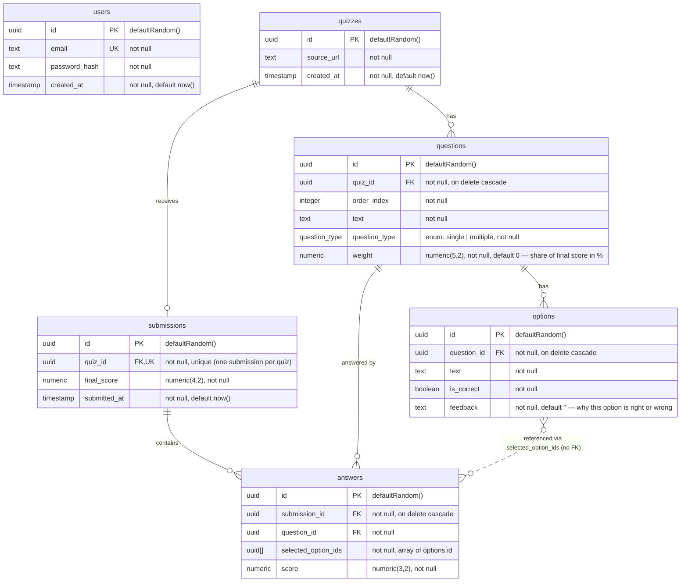

# Database Schema

PostgreSQL via Drizzle ORM. Source of truth: [`apps/api/src/db/schema.ts`](../apps/api/src/db/schema.ts).

## Entity-Relationship Diagram

## Enums

| Name | Values |
| --- | --- |
| `question_type` | `single`, `multiple` |

## Relationships

| Parent | Child | FK column | Cardinality | On delete |
| --- | --- | --- | --- | --- |
| `quizzes` | `questions` | `questions.quiz_id` | 1 → N | cascade |
| `questions` | `options` | `options.question_id` | 1 → N | cascade |
| `quizzes` | `submissions` | `submissions.quiz_id` | 1 → 0..1 (unique) | no action |
| `submissions` | `answers` | `answers.submission_id` | 1 → N | cascade |
| `questions` | `answers` | `answers.question_id` | 1 → N | no action |
| `options` | `answers` | `answers.selected_option_ids` (uuid array) | N ↔ N | none (no FK constraint) |

## Notes

- `users` is standalone — no FK links to quizzes or submissions today.
- `questions.weight` values within a quiz sum to 100.
- `answers.selected_option_ids` is a `uuid[]`; referential integrity to `options` is enforced at the application layer, not by the database.
- Only `users`, `quizzes` and `submissions` carry timestamps; `questions`, `options`, `answers` have none.
- `options.feedback` is part of the answer key alongside `is_correct`: the API only reveals it once the quiz has been submitted. It defaults to `''` so options created before the column existed stay valid.
